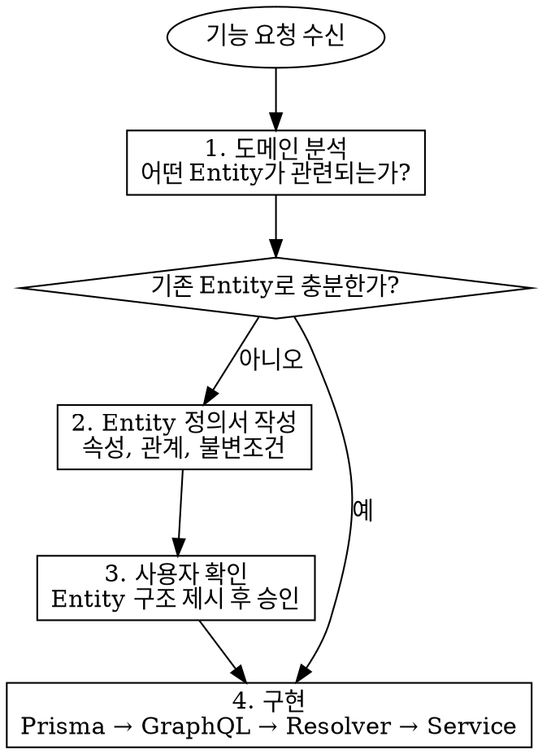

# Entity-First Development

## Overview

기능을 만들기 전에 **도메인 Entity를 먼저 정의**한다. "이 기능에 뭐가 필요하지?"가 아니라 **"이 도메인에 어떤 개체가 존재하지?"**로 시작한다.

## Core Principle

**기능은 Entity 위에 올라가는 것이지, Entity가 기능을 위해 만들어지는 것이 아니다.**

기능 요구사항에 맞춰 Entity를 반응적으로 설계하면 기능 변경 때마다 Entity가 흔들린다. 도메인 관점에서 Entity를 먼저 정의하면 여러 기능이 안정적인 Entity 위에 올라간다.

## When to Use

- 새로운 기능 요청을 받았을 때
- 새로운 GraphQL Query/Mutation을 추가할 때
- 기존에 없는 데이터를 다뤄야 할 때

## 현재 Entity 현황

이 프로젝트에 이미 존재하는 Entity:

| Entity | 위치 | 설명 |
|--------|------|------|
| **Member** | `prisma/schema.prisma` | 스터디 그룹 구성원 |
| **Session** | `prisma/schema.prisma` | 체크인~체크아웃 공부 기록 단위 |
| **DailyVacation** | `prisma/schema.prisma` | 특정 날짜의 휴가 사용 기록 |
| **MonthlyFee** | `prisma/schema.prisma` | 월 단위 회비 납부 상태 |

## 필수 절차



### 1. 도메인 분석

기능 요구사항을 받으면 바로 코드를 작성하지 않는다. 먼저 질문한다:

- **어떤 개체(Entity)가 이 도메인에 존재하는가?**
- **각 Entity의 본질적 속성은 무엇인가?** (기능이 아닌 도메인 관점)
- **Entity 간 관계는 무엇인가?** (1:1, 1:N, N:M)
- **기존 Entity(Member, Session, DailyVacation, MonthlyFee)와 어떻게 연결되는가?**
- **계산값(Derived Value)과 Entity를 구분했는가?** (기존 데이터에서 도출 가능한 값은 Entity가 아니다)

**"간단한 기능이니까 분석 안 해도 된다"는 합리화다.** 기존 Entity로 충분한 경우에도 도메인 분석은 반드시 수행한다. 분석 결과가 "새 Entity 불필요"이면 그것이 올바른 결론이다.

### 2. Entity 정의서 작성

새 Entity가 필요하면 다음 형식으로 정의서를 작성하여 사용자에게 제시한다:

```
## Entity: [이름]

**정의:** [이 Entity가 무엇인지 한 문장으로]

**속성:**
- [속성명]: [타입] - [설명]
- ...

**관계:**
- [관련 Entity] → [관계 유형] - [설명]

**불변조건 (Invariants):**
- [항상 참이어야 하는 규칙]

**생명주기:**
- 생성 조건: [언제 만들어지는가]
- 소멸 조건: [언제 삭제되는가, 또는 삭제 불가]
```

### 3. 사용자 확인

Entity 정의서를 사용자에게 보여주고 **승인을 받은 후** 구현을 시작한다.

- 속성이 맞는지
- 관계가 맞는지
- 빠진 Entity가 없는지

**승인 없이 구현을 시작하지 않는다.**

### 4. 구현 순서

승인 후 이 프로젝트의 구조에 맞춰 다음 순서로 구현한다:

1. **Prisma 스키마** — `prisma/schema.prisma`에 model 추가 → `prisma migrate dev`
2. **GraphQL 타입** — `src/schema/[entity].ts`에 typeDefs 작성 → `src/schema/index.ts`에 등록
3. **서비스 로직** — `src/services/[entity].ts`에 순수 비즈니스 로직 함수
4. **Resolver** — `src/resolvers/[entity].ts`에 Query/Mutation 구현 → `src/resolvers/index.ts`에 등록
5. **상수** — 필요 시 `src/constants.ts`에 비즈니스 규칙 상수 추가

## Entity vs 계산값 구분

모든 데이터가 Entity는 아니다. 기존 Entity에서 도출 가능한 값은 **계산값(Derived Value)**이다.

- **Entity**: 독립적으로 존재하는 도메인 개체. 자체 생명주기가 있다. → Prisma model로 정의
- **계산값**: 기존 Entity의 데이터를 집계/변환한 결과. → GraphQL type + resolver에서 계산

이 프로젝트의 예시:
- Entity: `Member`, `Session`, `DailyVacation`, `MonthlyFee`
- 계산값: `AttendanceSummary`, `CalendarDay`, `MonthlySummaryResult`, `RankingEntry`, `FeeStatusEntry`, `currentStatus`, `todayStudyMinutes`, `durationMinutes`

## Red Flags - 잘못된 접근

- "이 기능에 필요한 필드가 뭐지?" → 기능이 Entity를 결정하고 있다
- Entity 정의 없이 바로 리졸버 작성 시작
- 기존 Entity에 기능 전용 필드를 무분별하게 추가
- Entity 간 관계를 고려하지 않고 독립적으로 설계
- 사용자 확인 없이 Entity 구조를 확정하고 구현 진행
- "간단한 기능이라 도메인 분석은 필요 없다"
- 계산값을 별도 Prisma model로 저장하려는 시도

## Common Mistakes

| 실수 | 올바른 접근 |
|------|------------|
| 기능 요구사항의 UI 필드를 그대로 Entity 속성으로 | 도메인 본질에서 속성 도출 |
| 한 Entity에 모든 것을 넣기 | 책임 분리, 필요하면 Entity 분할 |
| 관계를 나중에 추가 | 처음부터 관계를 명시적으로 정의 |
| "나중에 리팩토링하면 되지" | Entity 구조는 변경 비용이 높으므로 처음에 제대로 |
| GraphQL type을 먼저 만들고 Prisma model을 끼워맞추기 | Prisma model(도메인)이 먼저, GraphQL은 그 위의 표현 |
