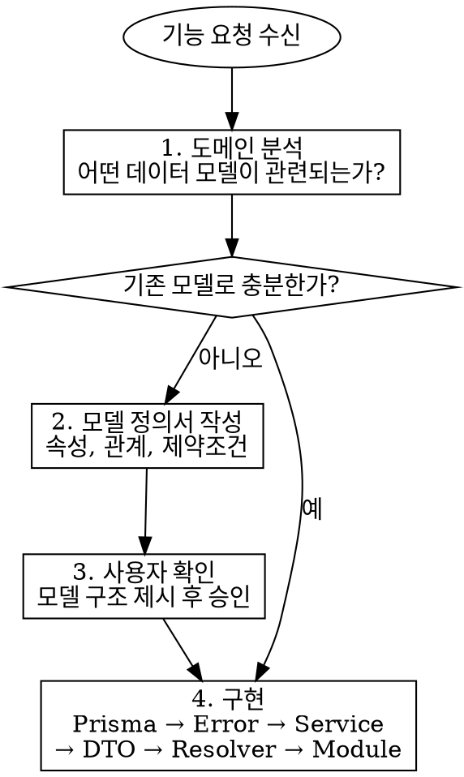

# Schema-First Development

## Overview

기능을 만들기 전에 **Prisma 스키마(데이터 모델)를 먼저 정의**한다. "이 기능에 뭐가 필요하지?"가 아니라 **"이 도메인에 어떤 데이터가 존재하지?"**로 시작한다.

## Core Principle

**기능은 데이터 모델 위에 올라가는 것이지, 데이터 모델이 기능을 위해 만들어지는 것이 아니다.**

기능 요구사항에 맞춰 모델을 반응적으로 설계하면 기능 변경 때마다 모델이 흔들린다. 도메인 관점에서 모델을 먼저 정의하면 여러 기능이 안정적인 모델 위에 올라간다.

## When to Use

- 새로운 기능 요청을 받았을 때
- 새로운 GraphQL Query/Mutation을 추가할 때
- 기존에 없는 데이터를 다뤄야 할 때

## 현재 모델 현황

이 프로젝트에 이미 존재하는 Prisma model:

| Model             | 위치                   | 설명                           |
| ----------------- | ---------------------- | ------------------------------ |
| **Member**        | `prisma/schema.prisma` | 스터디 그룹 구성원             |
| **Session**       | `prisma/schema.prisma` | 체크인~체크아웃 공부 기록 단위 |
| **DailyVacation** | `prisma/schema.prisma` | 특정 날짜의 휴가 사용 기록     |
| **MonthlyFee**    | `prisma/schema.prisma` | 월 단위 회비 납부 상태         |

## 아키텍처 레이어 구조

```
Resolver → Service → Prisma
    ↓          ↓
  DTO      비즈니스 로직
```

각 레이어의 역할:

| 레이어       | 역할                                                      | 위치                                    |
| ------------ | --------------------------------------------------------- | --------------------------------------- |
| **Service**  | 비즈니스 로직 실행. PrismaService로 데이터 접근            | `src/modules/[domain]/[domain].service.ts`  |
| **Resolver** | GraphQL Query/Mutation 처리. Service 호출                  | `src/modules/[domain]/[domain].resolver.ts` |
| **DTO**      | GraphQL Input/ObjectType 정의 (Code-First)                 | `src/modules/[domain]/dto/`                 |
| **Error**    | 도메인 에러 클래스 정의 (GraphQLError 상속)                 | `src/modules/[domain]/errors/`              |
| **Module**   | NestJS DI 컨테이너. Provider 등록                          | `src/modules/[domain]/[domain].module.ts`   |

## 필수 절차



### 1. 도메인 분석

기능 요구사항을 받으면 바로 코드를 작성하지 않는다. 먼저 질문한다:

- **어떤 데이터 모델이 이 도메인에 존재하는가?**
- **각 모델의 본질적 속성은 무엇인가?** (기능이 아닌 도메인 관점)
- **모델 간 관계는 무엇인가?** (1:1, 1:N, N:M)
- **기존 모델(Member, Session, DailyVacation, MonthlyFee)과 어떻게 연결되는가?**
- **계산값(Derived Value)과 모델을 구분했는가?** (기존 데이터에서 도출 가능한 값은 모델이 아니다)

**"간단한 기능이니까 분석 안 해도 된다"는 합리화다.** 기존 모델로 충분한 경우에도 도메인 분석은 반드시 수행한다. 분석 결과가 "새 모델 불필요"이면 그것이 올바른 결론이다.

### 2. 모델 정의서 작성

새 모델이 필요하면 다음 형식으로 정의서를 작성하여 사용자에게 제시한다:

```
## Model: [이름]

**정의:** [이 모델이 무엇인지 한 문장으로]

**속성:**
- [속성명]: [타입] - [설명]
- ...

**관계:**
- [관련 모델] → [관계 유형] - [설명]

**제약조건:**
- [항상 참이어야 하는 규칙]

**생명주기:**
- 생성 조건: [언제 만들어지는가]
- 소멸 조건: [언제 삭제되는가, 또는 삭제 불가]
```

### 3. 사용자 확인

모델 정의서를 사용자에게 보여주고 **승인을 받은 후** 구현을 시작한다.

- 속성이 맞는지
- 관계가 맞는지
- 빠진 모델이 없는지

**승인 없이 구현을 시작하지 않는다.**

### 4. 구현 순서

승인 후 이 프로젝트의 구조에 맞춰 다음 순서로 구현한다:

#### 4-1. Prisma 스키마

`prisma/schema.prisma`에 model 추가 → `prisma migrate dev`

#### 4-2. Error 클래스

`src/modules/[domain]/errors/[domain].error.ts`

도메인 에러는 `GraphQLError`를 상속하여 정의한다. `instanceof`로 에러를 특정할 수 있고, `extensions.code`로 클라이언트에서 에러를 식별한다.

```typescript
import { GraphQLError } from 'graphql';

export class MemberNotFoundError extends GraphQLError {
  static readonly CODE = 'MEMBER_NOT_FOUND';

  constructor() {
    super('Member not found', {
      extensions: { code: MemberNotFoundError.CODE },
    });
  }
}

export class MemberNameAlreadyOccupiedError extends GraphQLError {
  static readonly CODE = 'MEMBER_NAME_ALREADY_OCCUPIED';

  constructor() {
    super('Member name already occupied', {
      extensions: { code: MemberNameAlreadyOccupiedError.CODE },
    });
  }
}
```

#### 4-3. Service

`src/modules/[domain]/[domain].service.ts`

비즈니스 로직을 Service에 집중한다. PrismaService를 직접 주입받아 데이터에 접근한다. 도메인 에러를 throw한다.

```typescript
@Injectable()
export class MemberService {
  constructor(private readonly prisma: PrismaService) {}

  async create(input: CreateMemberInput) {
    return this.prisma.member.create({
      data: { name: input.name, role: input.role },
    });
  }

  async findOneById(id: number) {
    const member = await this.prisma.member.findUnique({ where: { id } });
    if (!member) throw new MemberNotFoundError();
    return member;
  }

  async findAll() {
    return this.prisma.member.findMany();
  }
}
```

#### 4-4. DTO (Code-First GraphQL 타입)

NestJS GraphQL Code-First 방식으로 `@ObjectType`, `@InputType` 데코레이터를 사용한다.

**ObjectType (응답)** — `src/modules/[domain]/dto/[domain].object.ts`

```typescript
@ObjectType()
export class MemberObject {
  @Field(() => Int)
  id: number;

  @Field()
  name: string;

  @Field(() => MemberRoleEnum)
  role: MemberRole;

  @Field()
  createdAt: Date;

  @Field()
  updatedAt: Date;
}
```

**InputType (입력)** — `src/modules/[domain]/dto/[use-case].input.ts`

```typescript
@InputType()
export class CreateMemberInput {
  @Field()
  name: string;

  @Field(() => MemberRoleEnum)
  role: MemberRole;
}
```

**Enum 등록:**

```typescript
registerEnumType(MemberRole, { name: 'MemberRole' });
```

#### 4-5. Resolver

`src/modules/[domain]/[domain].resolver.ts`

GraphQL Query/Mutation 처리. Service를 호출하고, 필드 리졸버로 계산값을 반환한다.

```typescript
@Resolver(() => MemberObject)
export class MemberResolver {
  constructor(private readonly memberService: MemberService) {}

  @Query(() => [MemberObject])
  async members() {
    return this.memberService.findAll();
  }

  @Query(() => MemberObject)
  async member(@Args('id', { type: () => Int }) id: number) {
    return this.memberService.findOneById(id);
  }

  @Mutation(() => MemberObject)
  async createMember(@Args('input') input: CreateMemberInput) {
    return this.memberService.create(input);
  }

  // 계산값은 @ResolveField로 처리
  @ResolveField(() => String)
  async currentStatus(@Parent() member: MemberObject) {
    return this.memberService.deriveStatus(member.id);
  }
}
```

#### 4-6. Module 등록

`src/modules/[domain]/[domain].module.ts`

```typescript
@Module({
  providers: [MemberResolver, MemberService],
  exports: [MemberService],
})
export class MemberModule {}
```

`app.module.ts`에 import 추가. GraphQL 모듈은 루트에서 한 번 설정:

```typescript
@Module({
  imports: [
    GraphQLModule.forRoot<ApolloDriverConfig>({
      driver: ApolloDriver,
      autoSchemaFile: true,  // Code-First 자동 스키마 생성
    }),
    MemberModule,
    SessionModule,
    // ...
  ],
})
export class AppModule {}
```

## 모듈 디렉터리 구조

```
src/modules/[domain]/
  [domain].module.ts
  [domain].service.ts
  [domain].resolver.ts
  dto/
    [domain].object.ts        # @ObjectType (응답)
    [use-case].input.ts       # @InputType (입력)
  errors/
    [domain].error.ts
```

## 핵심 패턴 요약

### 에러 흐름

```
도메인 에러 클래스 (GraphQLError 상속) → Service에서 throw → Apollo가 클라이언트에 전달
```

- 도메인 에러는 `GraphQLError`를 상속한 클래스로 정의한다
- 각 에러는 `static readonly CODE`를 가져 클라이언트에서 `extensions.code`로 식별한다
- Service에서 throw하면 별도 변환 없이 Apollo가 자동 전달한다
- 필요시 `instanceof`로 에러를 특정할 수 있다

### 계산값 처리

Prisma model에 없는 계산값은 `@ResolveField()`로 처리한다.

```typescript
@ResolveField(() => Int)
async todayStudyMinutes(@Parent() member: MemberObject) {
  return this.memberService.calculateTodayStudyMinutes(member.id);
}
```

## 모델 vs 계산값 구분

모든 데이터가 Prisma model은 아니다. 기존 모델에서 도출 가능한 값은 **계산값(Derived Value)**이다.

- **모델**: 독립적으로 존재하는 도메인 데이터. 자체 생명주기가 있다. → Prisma model로 정의
- **계산값**: 기존 모델의 데이터를 집계/변환한 결과. → Service에서 계산, `@ResolveField`로 반환

이 프로젝트의 예시:

- 모델: `Member`, `Session`, `DailyVacation`, `MonthlyFee`
- 계산값: `AttendanceSummary`, `CalendarDay`, `MonthlySummaryResult`, `RankingEntry`, `FeeStatusEntry`, `currentStatus`, `todayStudyMinutes`, `durationMinutes`

## Red Flags - 잘못된 접근

- "이 기능에 필요한 필드가 뭐지?" → 기능이 모델을 결정하고 있다
- 모델 정의 없이 바로 Resolver 작성 시작
- 기존 모델에 기능 전용 필드를 무분별하게 추가
- 모델 간 관계를 고려하지 않고 독립적으로 설계
- 사용자 확인 없이 모델 구조를 확정하고 구현 진행
- "간단한 기능이라 도메인 분석은 필요 없다"
- 계산값을 별도 Prisma model로 저장하려는 시도
- Resolver에서 비즈니스 로직 처리 (Service에 위임해야 함)

## Common Mistakes

| 실수                                             | 올바른 접근                                      |
| ------------------------------------------------ | ------------------------------------------------ |
| 기능 요구사항의 UI 필드를 그대로 모델 속성으로   | 도메인 본질에서 속성 도출                        |
| 한 모델에 모든 것을 넣기                         | 책임 분리, 필요하면 모델 분할                    |
| 관계를 나중에 추가                               | 처음부터 관계를 명시적으로 정의                  |
| "나중에 리팩토링하면 되지"                       | 모델 구조는 변경 비용이 높으므로 처음에 제대로   |
| DTO를 먼저 만들고 모델을 끼워맞추기              | Prisma model(도메인)이 먼저, DTO는 그 위의 표현  |
| Resolver에서 Prisma 직접 호출                    | Service를 통해 데이터 접근                       |
| 계산값을 Query로 처리                            | @ResolveField로 부모 타입에 연결                 |
| GraphQLError를 직접 생성하여 throw               | 도메인 에러 클래스를 정의하여 throw               |
